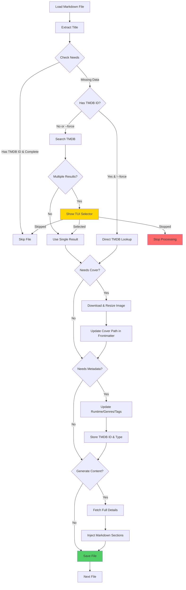

# Obsidian TMDB Cover

Automatically fetch TMDB cover art, metadata, and content sections for your Obsidian movie/TV show notes.

## Features

- 🎬 Search TMDB for movies and TV shows
- 🖼️ Download and resize poster art to `attachments/`
- 📝 Update frontmatter with runtime, genres, and TMDB IDs
- 📄 Generate markdown sections (overview, info tables, seasons)
- 🎨 Interactive TUI selector for multiple matches
- 🔄 Smart caching with stored TMDB IDs

## Quick Start

```bash
# Install
go install github.com/lepinkainen/obsidian-tmdb-cover/cmd/obsidian-tmdb-cover@latest

# Set API key (get free key at themoviedb.org)
export TMDB_API_KEY=your_api_key_here

# Process your vault
obsidian-tmdb-cover /path/to/obsidian/vault
```

## Usage

```bash
# Process vault or single file
obsidian-tmdb-cover /path/to/vault
obsidian-tmdb-cover /path/to/note.md

# Force re-search even with stored TMDB IDs
obsidian-tmdb-cover --force /path/to/vault

# Generate content sections
obsidian-tmdb-cover --generate-content /path/to/vault
obsidian-tmdb-cover -g --content-sections overview,info,seasons /path/to/vault
```

## How It Works



## Example

**Before:**
```yaml
---
title: The Matrix
---
```

**After:**
```yaml
---
title: The Matrix
cover: attachments/The Matrix - cover.jpg
runtime: 136
tags: [movie/Action, movie/Science-Fiction]
tmdb_id: 603
tmdb_type: movie
---
```

**With --generate-content:**
```markdown
---
title: The Matrix
cover: attachments/The Matrix - cover.jpg
runtime: 136
tags: [movie/Action, movie/Science-Fiction]
tmdb_id: 603
tmdb_type: movie
---

<!-- TMDB_DATA_START -->
## Overview

A computer hacker learns from mysterious rebels about the true nature of his reality...

> _"Welcome to the Real World"_

## Movie Info

| | |
|---|---|
| **Status** | Released |
| **Runtime** | 136 min |
| **Released** | 1999-03-30 |
| **Rating** | ⭐ 8.2/10 (25,123 votes) |
| **Budget** | $63,000,000 |
| **Revenue** | $463,517,383 |
| **Origin** | 🇺🇸 US |
| **IMDB** | [imdb.com/title/tt0133093](https://www.imdb.com/title/tt0133093/) |
<!-- TMDB_DATA_END -->
```

## Build from Source

```bash
git clone https://github.com/lepinkainen/obsidian-tmdb-cover.git
cd obsidian-tmdb-cover
go build -o bin/obsidian-tmdb-cover ./cmd/obsidian-tmdb-cover
```

## Requirements

- Go 1.25+
- TMDB API key ([free registration](https://www.themoviedb.org/settings/api))

## Contributing

See [CLAUDE.md](CLAUDE.md) for architecture and [AGENTS.md](AGENTS.md) for development guidelines.

## License

MIT
